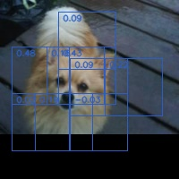
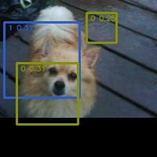
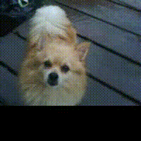
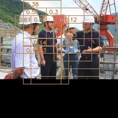
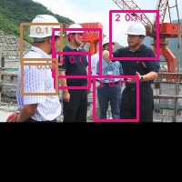
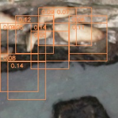
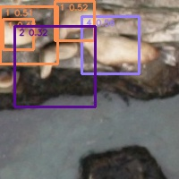
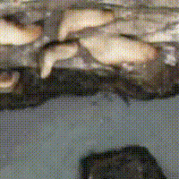

# DOT-TOD

DOT TOD is a deep reinforcement learning based objects detection. It is using two agent DOT (detection of target) and TOD (tiny object detection)to realize a fully based RL object detection.
DOT go trough the entire image by sliding window, deciding if a window is a region of interest or not.
TOD is charged to adjust the window has a bounding box that fit the best the object inside.

<p float="left">



</p>

The above left image show the state of the image after DOT has process it. The middle image, is the work of TOD with also bounding boxes cleaning and the last .gif show the whole process.

This exemple is from the dataset Oxford pet: https://public.roboflow.com/object-detection/oxford-pets

<p float="left">



</p>

Another example from the dataset Hard hat worker: https://public.roboflow.com/object-detection/hard-hat-workers

<p float="left">



</p>

A last example from the dataset NOAA: https://www.kaggle.com/competitions/noaa-fisheries-steller-sea-lion-population-count/overview

**Caution:** DOT TOD is, in is current state, not ready to be used. It is more a proof of concept to attempt to reduce the size of object detection models using Deep RL.
If you want to use it anyway, you can follow the installation and usage instructions.

## installation instructions

clone this repository:

```
git clone https://github.com/UncleBen420/DOT-TOD-deep-reinforce-learning-based-object-detection-.git
```

install dependencies using pip install:

```
pip install -r requirements.txt
```

Your are now able to use DOT TOD.

# usage instructions

## Training

To train the agents you can use the train.py file in this repository.

```
python3 train.py -tr dataset/train -ts dataset/test -nb 3 -pm
```

here are the argument you can use to custom the training:

```
-tr, --train_path : path to the training data
-ts, --test_path : path to the testing data
-ed, --episode_dot : duration in episode of the training of DOT
-et, --episode_tod : duration in episode of the training of TOD
-nb, --nb_class: number of classes present in the dataset
-a, --learning_rate
-gd, --gamma_dot: discount-rate for the discounted rewards of DOT
-gt, --gamma_tod: discount-rate for the discounted rewards of TOD
-epsd, --epsilon_dot: epsilon for the epsilon-greedy function of DOT
-epst, --epsilon_tod: epsilon for the epsilon-greedy function of TOD
-lrg, --lr_gamma: every 100 episode the learning rate of the agent drop by this factor (default is 1.)
-pm, --plot_metrics: if true plot the metrics corresponding to the training and evaluation
```

The data used for training and testing must be in this format:
```
Folder
  |-img
  |-bboxes
```

the image contained in the img folder must have a file matching their name but in .txt format in the folder bboxes.
Those file contains all objects in the corresponding image given:
the label, the x of the left-upmost point, the y of the left-upmost point, the width and the height:

here is an exemple of a file containing multiple objects:

```
0 0 0 17 32
0 25 0 18 28
0 49 0 13 43
0 76 0 21 44
0 107 0 22 34
0 65 14 10 53
3 0 33 18 11
3 33 38 15 29
3 79 56 49 17
0 0 68 43 44
0 52 86 50 18
3 16 116 46 24
```

## Inference

TODO
